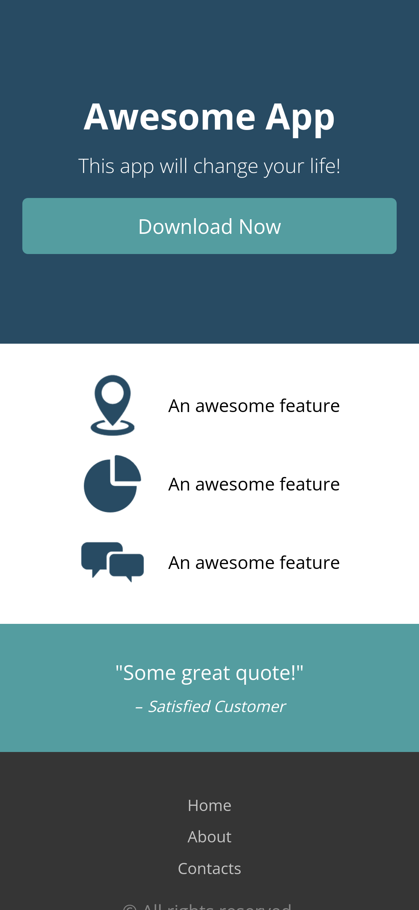
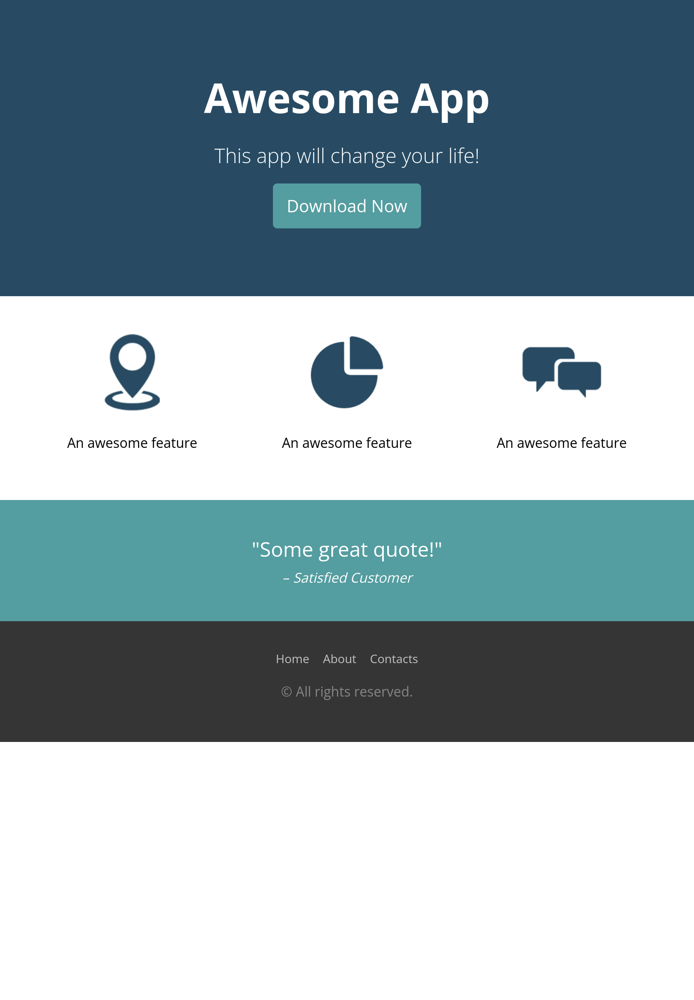

# Sololearn_responsive-design

* Projeto desenvolido durante o curso de web responsiva da plataforma [@Sololearn](https://www.sololearn.com/learning/1162).

## Construído com:
* HTML5 Semântico
* CSS3 Responsivo

### Interface mobile

### Interface Desktop/Tablet

